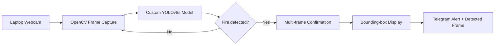
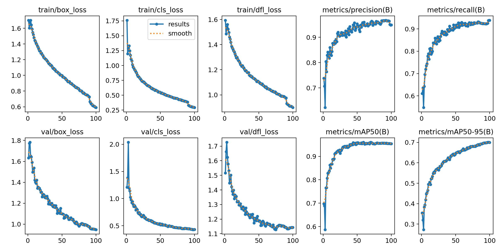
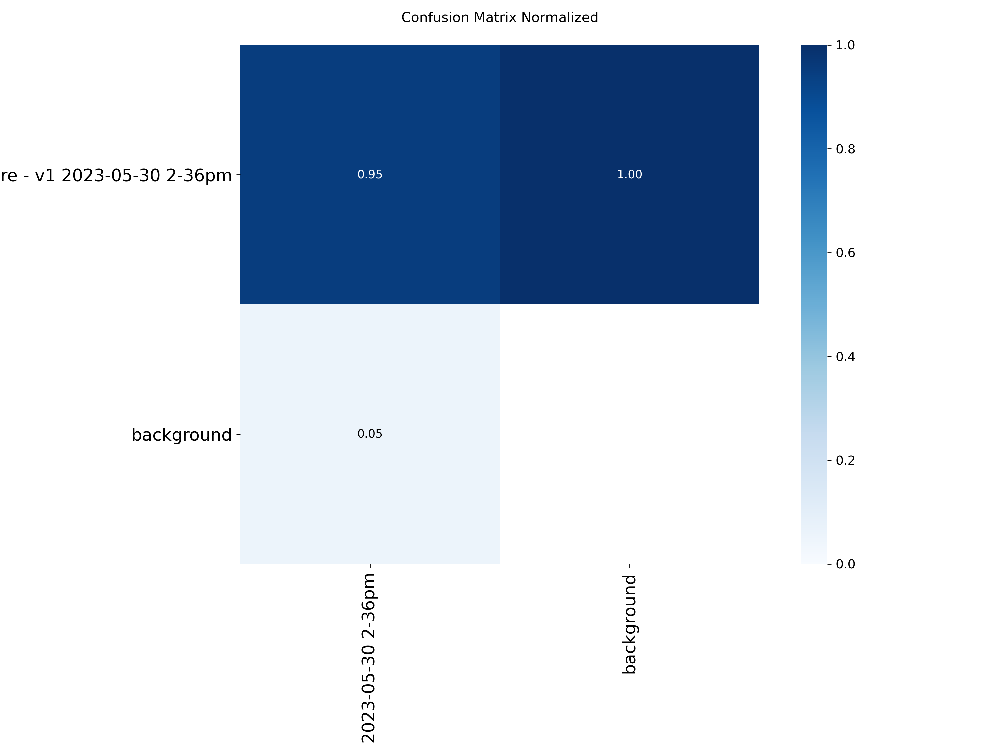
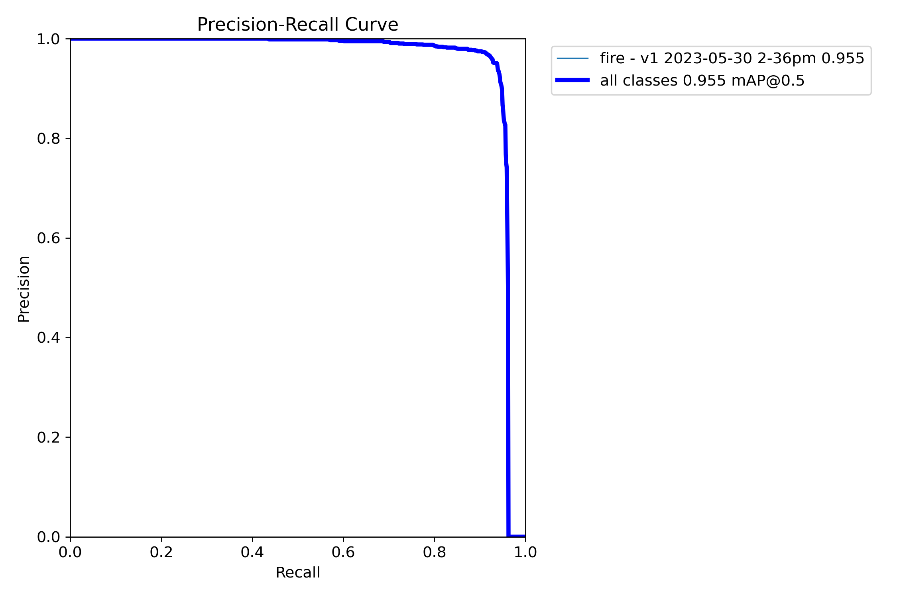
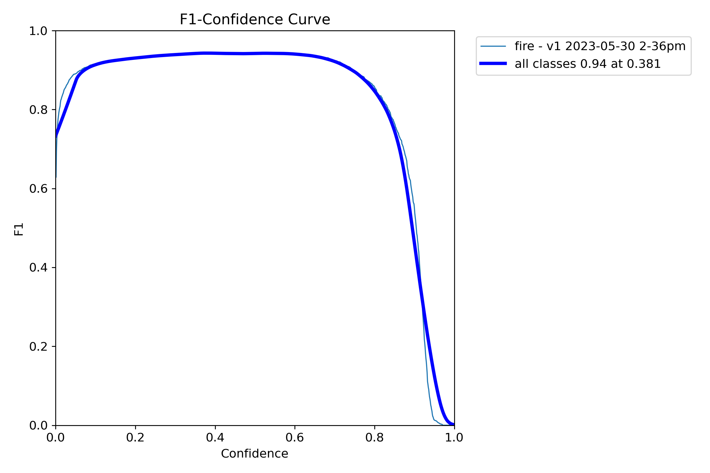
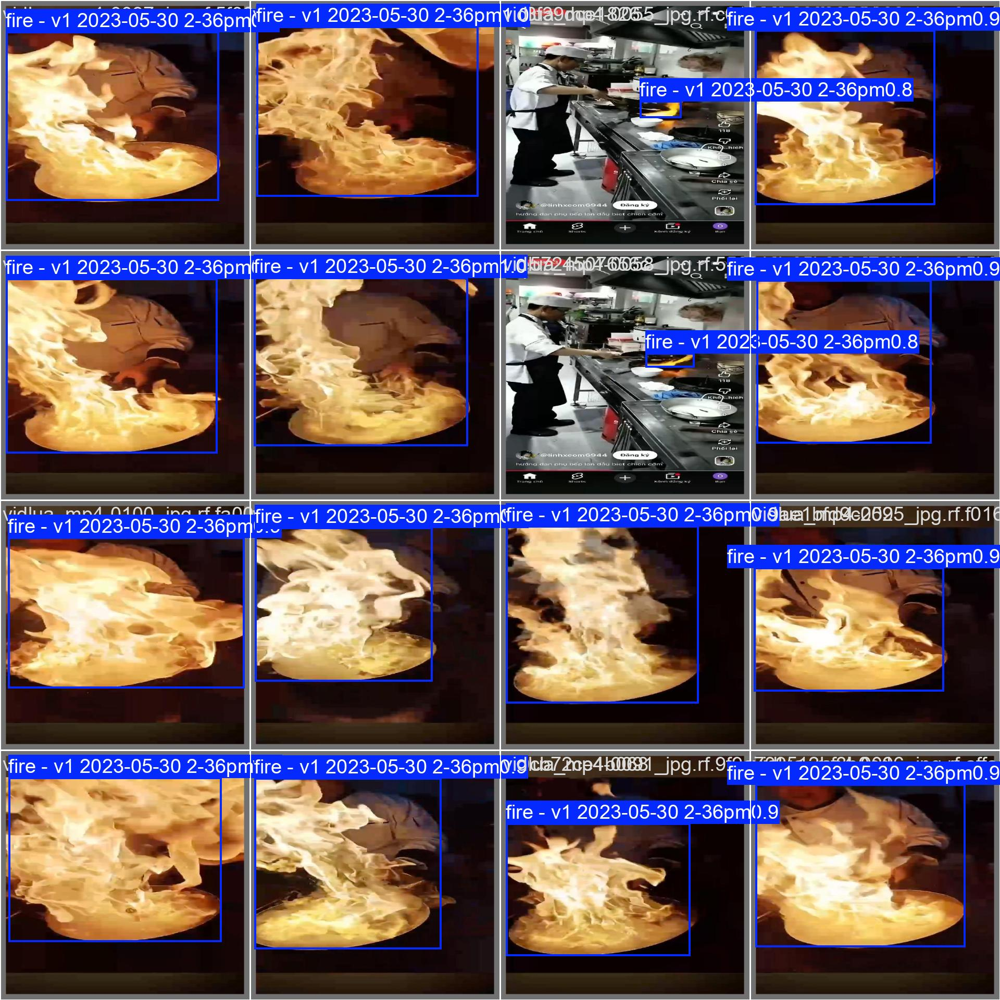
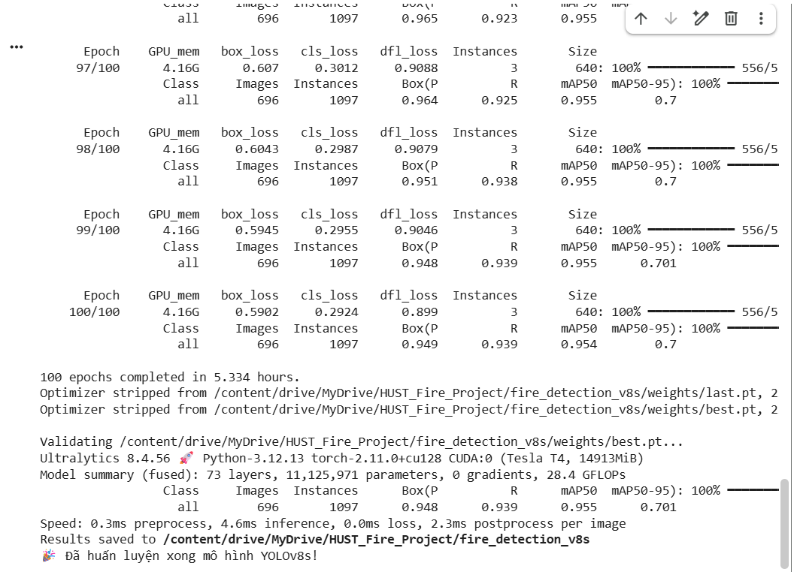

# Real-Time Fire Detection and Telegram Alert System using YOLOv8

An individual **Embedded Software Design** project that detects fire from a live webcam stream using a custom-trained **YOLOv8s** model and sends an alert image through **Telegram** when a fire event is confirmed.

> **Current prototype:** Tested on a laptop webcam.  
> **Research direction:** Embedded AI / Edge AI — especially model optimization, deployment on resource-constrained devices, and robust real-world sensing.

---

## 1. Project Overview

The system processes webcam frames, performs fire detection using a custom YOLOv8s model, confirms the event across multiple consecutive frames to reduce unstable one-frame detections, and sends a Telegram alert containing the detected frame.



The current version runs inference on a laptop. It is **not yet an Edge AI deployment**.

---

## 2. Main Features

- Real-time fire detection using a custom-trained **YOLOv8s**
- Live webcam inference using **OpenCV**
- Configurable confidence threshold
- Multi-frame fire confirmation to reduce transient false positives
- Automatic alarm clearing after consecutive negative frames
- Telegram alert containing the detected frame
- Asynchronous Telegram sending so network requests do not block the inference loop
- Hard-negative data added to improve robustness against red/orange light sources

---

## 3. Dataset Preparation

The initial fire-detection dataset was sourced from **Roboflow** and extended with additional real-world samples.

Additional data collected by the author included:

- real fire images from practical tests
- red-light images used as **hard-negative samples**

The red-light samples were intentionally added because bright red/orange light sources can visually resemble fire and may cause false positives.

The Roboflow project contained approximately **3,834 source images before export / augmentation**.

### Dataset sample


> The full dataset is not included in this repository.  
> The original Roboflow dataset/project URL should be added here if public redistribution is permitted by its license.

---

## 4. Model Training

- **Model:** YOLOv8s
- **Task:** Object detection
- **Training environment:** Google Colab
- **GPU:** NVIDIA Tesla T4
- **Epochs:** 100
- **Training time:** approximately 5.33 hours
- **Validation images:** 696
- **Validation instances:** 1,097
- **Model parameters:** approximately 11.1M
- **Compute:** approximately 28.4 GFLOPs

### Final validation metrics

| Metric | Result |
|---|---:|
| Precision | **0.948** |
| Recall | **0.939** |
| mAP@0.50 | **0.955** |
| mAP@0.50:0.95 | **0.701** |

The validation log reported approximately **4.6 ms inference time per image on a Tesla T4**.  
This value refers to the Colab validation environment and should not be interpreted as laptop or future edge-device latency.

### Training curves



### Normalized confusion matrix



### Precision-Recall curve



### F1 curve



### Validation predictions



### Training summary



---

## 5. Demo

### Real-Time Fire Detection


### Telegram Alert


---

## 6. Project Structure

```text
real-time-fire-detection-yolov8/
├── assets/
│   ├── dataset_sample.png
│   ├── results.png
│   ├── confusion_matrix.png
│   ├── confusion_matrix_normalized.png
│   ├── pr_curve.png
│   ├── f1_curve.png
│   ├── validation_predictions.jpg
│   ├── training_summary.png
│   ├── fire_detection_demo.png
│   └── telegram_alert_demo.png
├── models/
│   └── fire.pt
├── notebooks/
│   └── fire_detectv8s.ipynb
├── fire_detector.py
├── telegram_alert.py
├── main.py
├── requirements.txt
├── .gitignore
└── README.md
```

| File | Purpose |
|---|---|
| `main.py` | Webcam inference, temporal fire confirmation, UI and alert workflow |
| `fire_detector.py` | Loads the trained YOLO model and performs inference |
| `telegram_alert.py` | Sends Telegram alerts asynchronously |
| `models/fire.pt` | Custom-trained YOLOv8s weights |
| `notebooks/fire_detectv8s.ipynb` | Google Colab training notebook |
| `requirements.txt` | Python dependencies |

---

## 7. Installation

### Requirements

- Python 3.13 tested for the local prototype
- Webcam
- Internet connection if Telegram alerts are enabled

Clone the repository:

```bash
git clone https://github.com/loido0806/real-time-fire-detection-yolov8.git
cd real-time-fire-detection-yolov8
```

Install dependencies:

```bash
python -m pip install -r requirements.txt
```

---

## 8. Run the Project

### Detection only

```bash
py -3.13 main.py --no-telegram
```

or:

```bash
python main.py --no-telegram
```

Press **Q** or **ESC** to exit.

### Useful options

Set the confidence threshold:

```bash
py -3.13 main.py --no-telegram --confidence 0.6
```

Use another camera:

```bash
py -3.13 main.py --camera 1 --no-telegram
```

Use a CUDA device when supported:

```bash
py -3.13 main.py --device 0 --no-telegram
```

---

## 9. Telegram Alert Setup

Create a Telegram bot using **BotFather**, obtain the bot token and chat ID, then set them as environment variables.

### PowerShell

```powershell
$env:TG_TOKEN="YOUR_BOT_TOKEN"
$env:TG_CHAT_ID="YOUR_CHAT_ID"
```

Run:

```powershell
py -3.13 main.py
```

When a fire event is confirmed, the program sends a Telegram alert containing the detected frame.

> **Security:** Never hard-code or commit a real Telegram bot token or chat ID to a public repository.

---

## 10. Fire Confirmation Logic

A single positive frame may be caused by noise or a temporary false detection.

The system therefore requires multiple consecutive positive frames before switching from:

```text
NORMAL -> FIRE
```

The alarm is cleared only after multiple consecutive frames without a fire detection.

This temporal confirmation helps reduce unstable one-frame alerts.

---

## 11. Current Limitations

- The current prototype has been tested on a laptop webcam
- The model has not yet been deployed on dedicated edge hardware
- Detection may still be affected by lighting, reflections, smoke and fire-like objects
- Laptop runtime performance has not yet been benchmarked systematically
- More out-of-distribution and hard-negative testing is needed
- This prototype relies mainly on visual information

---

## 12. Future Work — Embedded AI / Edge AI

The next stage is to move from laptop inference toward an embedded/edge implementation.

Planned directions include:

- deploy the model on an edge platform
- compare YOLOv8s with smaller models for lower inference latency
- export the model to ONNX / TensorRT / TFLite where appropriate
- investigate INT8 quantization and model compression
- benchmark latency, memory usage and power consumption
- expand hard-negative data to reduce false alarms
- evaluate robustness across more diverse environments
- explore integration with IoT sensors for multi-modal fire monitoring

This is the main direction I would like to continue exploring in **Embedded AI / Edge AI**.

---

## 13. Technology Stack

- Python
- YOLOv8 / Ultralytics
- OpenCV
- Google Colab
- Telegram Bot API
- Roboflow
- Git / GitHub

---

## 14. Disclaimer

This repository is an **academic prototype for learning and research purposes**.

It is **not a certified fire-safety system** and must not be used as a replacement for approved fire detection and alarm equipment.
