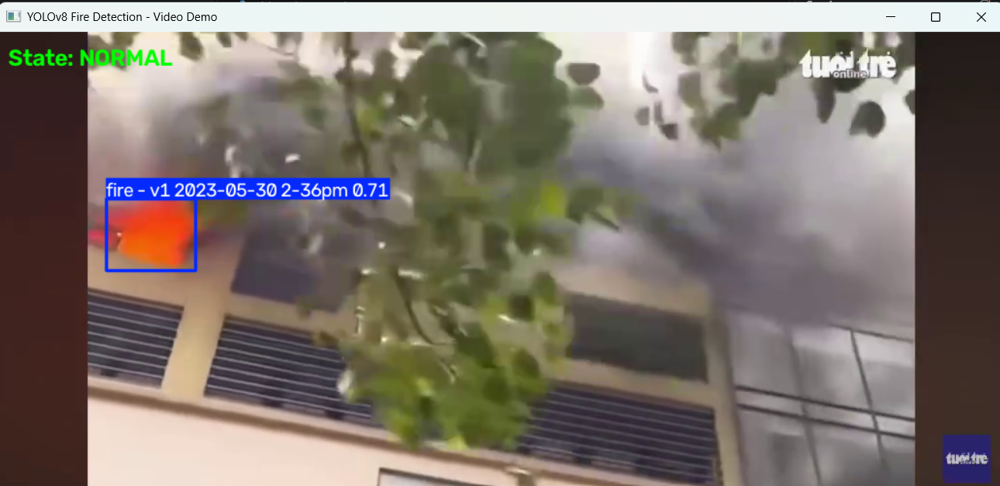
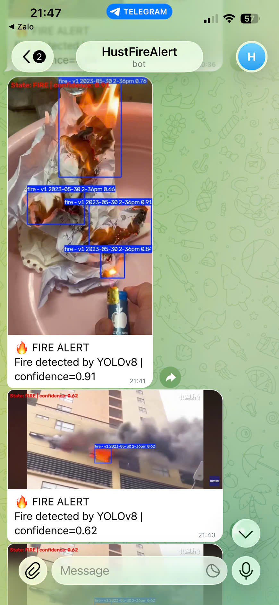
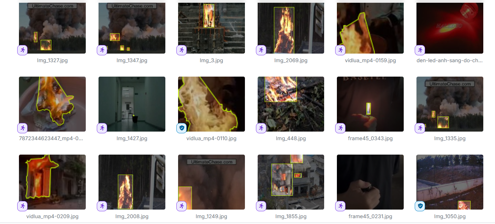

# Real-Time Fire Detection and Telegram Alert System using YOLOv8

An individual **Embedded Software Design** project that detects fire from a live webcam stream using a custom-trained **YOLOv8s** model and sends an image alert through **Telegram** when fire is confirmed.

> **Current status:** Working prototype tested with a laptop webcam.  
> **Research direction:** This project motivated my interest in Embedded AI / Edge AI, especially model optimization and deployment on resource-constrained devices.

---

## 1. Project Overview

The system performs real-time fire detection from camera frames and sends a Telegram notification when a fire event is confirmed.

### Current pipeline


The current prototype runs inference on a laptop. It is **not yet an Edge AI deployment**.

---

## 2. Main Features

- Real-time fire detection using a custom-trained **YOLOv8s** model
- Live webcam inference using **OpenCV**
- Configurable confidence threshold
- Multi-frame confirmation to reduce transient false positives
- Automatic alarm clearing after consecutive negative frames
- Telegram alert containing the detected frame
- Asynchronous Telegram sending so network requests do not block the camera loop
- Configurable camera index, image size, inference device and alert cooldown

---

## 3. Dataset Preparation

The initial fire-detection dataset was sourced from **Roboflow** and was extended with additional real-world samples.

I additionally collected:

- real fire images from practical tests
- red-light images as **hard-negative samples**

The red-light samples were added because bright red/orange light sources can visually resemble fire and may cause false positives. Adding these examples helps the model learn that a red light source is not necessarily a fire event.

The Roboflow project contained approximately **3.8k images before export / augmentation**.

> The full dataset is not included in this repository.  
> Add the original Roboflow dataset/project URL here if public sharing is permitted by its license.

---

## 4. Model Training

- **Model:** YOLOv8s
- **Task:** Object detection
- **Training environment:** Google Colab
- **Inference test:** Laptop webcam
- **Framework:** Ultralytics YOLO
- **Input:** Camera frames
- **Output:** Fire bounding boxes and confidence scores

### Recommended additions

If training outputs are still available, add the following to `assets/`:

- `results.png`
- `confusion_matrix.png`
- `PR_curve.png`
- `F1_curve.png`

These figures make the repository much more useful for technical review.

---

## 5. Demo

Create an `assets/` folder and add your own screenshots:

```text
assets/
├── fire_detection_demo.png
├── telegram_alert_demo.png
└── dataset_sample.png
```

Then uncomment / update the image paths below.

<!--
### Fire Detection



### Telegram Alert



### Dataset Samples


-->

---

## 6. Project Structure

```text
real-time-fire-detection-yolov8/
├── models/
│   └── fire.pt
├── fire_detector.py
├── main.py
├── telegram_alert.py
├── requirements.txt
├── .gitignore
└── README.md
```

### File description

| File | Purpose |
|---|---|
| `main.py` | Runs webcam capture, fire confirmation logic, display and alert workflow |
| `fire_detector.py` | Loads the trained YOLO model and performs fire detection |
| `telegram_alert.py` | Sends Telegram alerts asynchronously |
| `models/fire.pt` | Custom-trained YOLOv8s weights |
| `requirements.txt` | Python dependencies |

---

## 7. Installation

### Requirements

- Python 3.13 tested
- Webcam
- Internet connection if Telegram alerts are enabled

Clone the repository:

```bash
git clone https://github.com/loido0806/real-time-fire-detection-yolov8.git
cd real-time-fire-detection-yolov8
```

Install dependencies:

```bash
python -m pip install -r requirements.txt
```

---

## 8. Run the Project

### Detection only

Run without Telegram:

```bash
py -3.13 main.py --no-telegram
```

or:

```bash
python main.py --no-telegram
```

Press **Q** or **ESC** to exit.

### Useful options

Set the confidence threshold:

```bash
py -3.13 main.py --no-telegram --confidence 0.6
```

Use another camera:

```bash
py -3.13 main.py --camera 1 --no-telegram
```

Use a CUDA device when supported:

```bash
py -3.13 main.py --device 0 --no-telegram
```

---

## 9. Telegram Alert Setup

Create a Telegram bot using **BotFather**, obtain your bot token and chat ID, then set them as environment variables.

### PowerShell

```powershell
$env:TG_TOKEN="YOUR_BOT_TOKEN"
$env:TG_CHAT_ID="YOUR_CHAT_ID"
```

Run:

```powershell
py -3.13 main.py
```

When a fire event is confirmed, the program sends a Telegram alert with the detected frame.

> **Security:** Never hard-code or commit a real Telegram bot token or chat ID to a public repository.

---

## 10. Fire Confirmation Logic

A single positive frame may be caused by noise or a temporary false detection.

The program therefore requires multiple consecutive positive frames before switching from:

```text
NORMAL -> FIRE
```

Similarly, the alarm is cleared only after multiple consecutive frames without a fire detection.

This simple temporal confirmation mechanism helps reduce unstable one-frame alerts.

---

## 11. Current Limitations

- The current model has only been tested on a laptop webcam
- Performance has not yet been benchmarked on embedded hardware
- Detection can still be affected by lighting, camera quality, smoke, reflections and fire-like objects
- The current prototype is based mainly on visual information
- A systematic evaluation of precision, recall, mAP, latency and false-positive rate should be added

---

## 12. Future Work — Embedded AI / Edge AI

The next stage of this project is to move from laptop inference toward an embedded/edge implementation.

Planned directions include:

- deploy the model on an edge platform
- compare YOLOv8s with smaller models for lower inference latency
- export the model to ONNX / TensorRT / TFLite where appropriate
- investigate INT8 quantization and model compression
- measure inference latency, memory usage and power consumption
- expand hard-negative data to reduce false alarms
- evaluate precision, recall, mAP and false-positive rate systematically
- explore integration with IoT sensors for multi-modal fire monitoring

This is the main direction I would like to continue exploring in **Embedded AI / Edge AI**.

---

## 13. Technology Stack

- Python
- YOLOv8 / Ultralytics
- OpenCV
- Google Colab
- Telegram Bot API
- Roboflow
- Git / GitHub

---

## 14. Disclaimer

This repository is an **academic prototype for learning and research purposes**.

It is **not a certified fire-safety system** and must not be used as a replacement for approved fire detection and alarm equipment.
